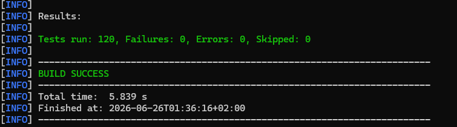

# Testrapportage — OpenMRS Communicatiemodule

**Project:** BeunMRS / OpenMRS Notificatiemodule
**Datum:** mei 2026 (testtelling geverifieerd 26 juni 2026)
**Aantal tests:** **129 geautomatiseerde JUnit-tests** (unit, 9 security, 10 contract/architectuur en 5 resilience-/job-/service-tests), allemaal groen op JDK 24, plus **3 Docker-gated integratietests** (`EndToEndNotificationFlowTest`, Testcontainers — afgebroken zonder draaiende Docker, totaal 132 mét Docker) · plus **2 operationele test-scripts** (loadtest met 3 scenario's, circuit-breaker chaos-test) · plus **2 hulpscripts** (alles-in-één runner, database cleanup).
**Testresultaat:** **129 tests groen — 0 failures, 0 errors** (zie run-bewijs hieronder). Performance-rapportage met meetbare doorvoer en uithoudingsvermogen vastgelegd in [`docs/PerformanceRapport/PERFORMANCE-RAPPORT.md`](../PerformanceRapport/PERFORMANCE-RAPPORT.md) ✅

> **Herkansing-update (juni 2026):** drie resilience-job-testklassen toegevoegd — `ReminderDispatchJobTest` (FR-1f: skip bij reeds-aangevangen afspraak), `FailedNotificationRetryJobTest` (NFR-6e/7: backoff 5→15→permanently_failed) en `DataRetentionJobTest` (NFR-10/11: 14-dagen PII-delete / 1-jaar audit-purge). Hiermee worden de scheduler-/retentie-eisen nu door asserts gedekt i.p.v. alleen "klasse aanwezig".

## Testuitvoering — run-bewijs (26 juni 2026)

Volledige suite gedraaid op **JDK 24** met Maven 3.9.16:

```
mvn -f notification-service/pom.xml test
...
[INFO] Results:
[INFO] Tests run: 129, Failures: 0, Errors: 0, Skipped: 0
[INFO] BUILD SUCCESS
[INFO] Total time:  7.206 s
[INFO] Finished at: 2026-06-26T02:20:31+02:00
```


- **129 tests groen** — 0 failures, 0 errors. Dekt unit, security, contract/architectuur én de vijf herkansing-toevoegingen (`ReminderDispatchJobTest`, `FailedNotificationRetryJobTest`, `DataRetentionJobTest`, `OutboxRelayJobTest`, `PersonContactServiceTest`).
- De **3 integratietests** (`EndToEndNotificationFlowTest`, Testcontainers) zijn **Docker-gated** en worden afgebroken zonder draaiende Docker. Mét `docker compose up -d notification-db` (of Docker Desktop aan) draaien ze mee → **132 totaal**.
- De `ERROR`-/`WARN`-stacktraces in de console-output zijn **verwacht en correct**: dat zijn de **negatieve tests** (provider-foutafhandeling — 429 rate-limit, 503, connection-refused, ontbrekend telefoonnummer) die de fout bewust uitlokken en loggen. Elke testklasse eindigt met `Failures: 0, Errors: 0`.

> **Aanbevolen bewijsstuk voor de demo/CGI:** voeg een screenshot van de `BUILD SUCCESS`-regel toe aan `docs/Tests/` (naast de bestaande screenshots).

---

## 1. Inleiding

Dit rapport laat zien dat de communicatiemodule **betrouwbaar** werkt en **uitbreidbaar** is. Beide punten worden via meerdere testmethodieken aangetoond.

| Testlaag                          | Doel                                                        | Aantal | Tooling                                        |
| --------------------------------- | ----------------------------------------------------------- | ------ | ---------------------------------------------- |
| **Unit tests**                    | Werking per component aantonen                              | 87     | JUnit 5 + Mockito                              |
| **Security tests**                | Authenticatie en tenant-isolatie aan de HTTP-grens          | 9      | JUnit 5 + Spring MockMvc                       |
| **Architectuur / contract tests** | Uitbreidbaarheid van de provider-interface bewijsbaar maken | 10     | JUnit 5 + Spring classpath scanner + reflectie |
| **Integratietests**               | End-to-end ketens valideren tegen een echte database        | 3      | JUnit 5 + Testcontainers (PostgreSQL 16)       |
| **Performance & resilience**      | Doorvoer meten en herstelvermogen valideren op de live stack | 2 scripts (4 scenario's) | PowerShell + draaiende Docker-stack + Grafana/Prometheus |

- **Betrouwbaarheid** wordt aangetoond door (a) unit tests die alle losse componenten controleren, (b) integratietests die de keten *register → dispatch → notification_log* tegen een echte PostgreSQL valideren, inclusief de productie-schema CHECK-constraints, én (c) een chaos-script dat een OpenMRS-storing simuleert en bewijst dat de circuit breaker + outbox geen berichten verliezen (NFR-7).
- **Uitbreidbaarheid** wordt geautomatiseerd gevalideerd door contract tests die op build-time elke `NotificationProvider`-implementatie controleren op uniqueness, Spring-discoverability en schema-conformiteit — architectuurregels worden dus tijdens de build afgedwongen, niet alleen in proza beschreven.
- **Security** wordt op systeemniveau gevalideerd: authenticatie, tenant-isolatie en ThreadLocal-hygiëne van `TenantApiKeyFilter` worden negatief getest (ontbrekende header, ongeldige sleutel, cross-tenant request) bovenop de bestaande AES-versleutelingstests.
- **Schaalbaarheid / doorvoer** wordt empirisch gemeten via een PowerShell load-script in drie scenario's (baseline / load / stress) — piekdoorvoer **166 notificaties/sec**, 100% outbox-relay slagingspercentage. Cijfers in [`docs/PERFORMANCE-RAPPORT.md`](PERFORMANCE-RAPPORT.md).

---

## 2. Overzicht van alle tests

### 2.1 Totaaloverzicht — unit tests

| Testklasse                         | Aantal tests | Onderdeel                            |
| ---------------------------------- | ------------ | ------------------------------------ |
| `MessageHelperTest`                | 16           | Berichten opmaken + PII-masking      |
| `AsyncFlowProviderTest`            | 10           | Provider: AsyncFlow                  |
| `LegacyLinkProviderTest`           | 9            | Provider: LegacyLink                 |
| `TenantRegistrationControllerTest` | 8            | Registratie van ziekenhuizen         |
| `OutboxServiceTest`                | 9            | Opslaan van berichten + DB-retry (FM-1) |
| `SwiftSendProviderTest`            | 7            | Provider: SwiftSend                  |
| `ReminderSchedulerTest`            | 7            | Plannen van herinneringen            |
| `AesEncryptionServiceTest`         | 6            | Versleuteling van gegevens           |
| `NotificationDispatcherTest`       | 6            | Doorsturen naar de juiste provider   |
| `AppointmentEventConsumerTest`     | 6            | Verwerken van afspraakwijzigingen    |
| `SecurePostProviderTest`           | 5            | Provider: SecurePost                 |
| `ReminderDispatchJobTest`          | 4            | Reminder-dispatch: skip reeds-aangevangen afspraak (FR-1f) |
| `FailedNotificationRetryJobTest`   | 5            | Retry-backoff 5→15 min → permanently_failed (NFR-6e/7) |
| `DataRetentionJobTest`             | 3            | Retentie: 14-dagen PII / 1-jaar audit (NFR-10/11)    |
| `OutboxRelayJobTest`               | 5            | Outbox-relay: publish + retry → failed_at (NFR-6e/7) |
| `PersonContactServiceTest`         | 4            | Telefoon-verrijking uit OpenMRS + cache (NFR-5)      |
| **Totaal unit tests**              | **110**      |                                      |

### 2.2 Aanvullende testlagen — security, architectuur, integratie

| Testklasse                         | Aantal | Soort                                        | Onderdeel                                                |
| ---------------------------------- | ------ | -------------------------------------------- | -------------------------------------------------------- |
| `TenantApiKeyFilterTest`           | 9      | Security                                     | Authenticatie en tenant-isolatie aan de HTTP-grens       |
| `NotificationProviderContractTest` | 10     | Architectuur / contract                      | Bewijst dat de provider-extension point sluitend is      |
| `EndToEndNotificationFlowTest`     | 3      | Integratie (Testcontainers + echte Postgres) | Volledige keten *register → dispatch → notification_log* |
| **Totaal aanvullend**              | **22** |                                              |                                                          |

**Som over alle testklassen: 132** (110 unit + 9 security + 10 contract/architectuur + 3 integratie). Hiervan draaien **129 groen zonder Docker** op JDK 24; de 3 Testcontainers-integratietests in `EndToEndNotificationFlowTest` vereisen een draaiende Docker (samen **132 mét Docker**). Geverifieerd 26 juni 2026.

> Het gezaghebbende totaal is de `Tests run: 129`-uitkomst (zonder Docker) uit het run-bewijs bovenaan dit document; mét Docker komen daar de 3 integratietests bij tot 132.

### 2.3 Operationele test-scripts — performance & resilience

Deze scripts draaien tegen de **live Docker-compose stack** en zijn bedoeld om eigenschappen te valideren die niet met mocks aan te tonen zijn: throughput onder belasting en gedrag tijdens een infrastructuurstoring. Ze worden handmatig gestart (niet via `mvn test`) en de resultaten worden vastgelegd in `docs/PERFORMANCE-RAPPORT.md`.

| Script                            | Scenario's | Soort                  | Doel                                                                                          |
| --------------------------------- | ---------- | ---------------------- | --------------------------------------------------------------------------------------------- |
| `scripts/loadtest.ps1`            | 3 (`baseline` / `load` / `stress`) | Performance / throughput | Genereert afspraken in OpenMRS, meet doorvoer + end-to-end latency uit `notification_log`. Ruimt eigen testdata **automatisch** op voor én na de run (idempotent). |
| `scripts/circuitbreaker-test.ps1` | 1 (volledig automatische chaos-flow) | Resilience / chaos     | Simuleert OpenMRS-storing, valideert circuit breaker + outbox buffering en herstel (NFR-7). **Volledig geautomatiseerd**: stopt en herstart de gateway zelf, detecteert circuit-breaker-opening via log-polling. Geen tweede terminal of handmatige stappen nodig. |
| `scripts/run-all-tests.ps1`       | alle bovenstaande | Suite-runner      | Voert baseline → load → stress achter elkaar uit in een **geïsoleerde tijdelijke database** (`notifications_test_<timestamp>`). Herstart `notification-svc` op de testdatabase, draait alle scenario's, zet `notification-svc` terug op productie en verwijdert de testdatabase. Productie-database wordt nooit aangeraakt. Flags: `-Quick` (30 s wachttijd), `-LoadOnly` (geen interactieve stappen), `-KeepData` (bewaar testdatabase na afloop voor inspectie), `-Pause` (pauzeeer tussen scenario's en toon psql-inlogcommando). |
| `scripts/cleanup-db.ps1`          | — | Database-onderhoud         | Verwijdert **alleen testdata** van tenants met slug `loadtest-*` of `cb-test-*` (alle gerelateerde tabellen in de juiste FK-volgorde). Productietenants en hun data worden nooit aangeraakt. Vult daarna `seen_appointments` **direct opnieuw** voor productietenants zodat de poller bestaande OpenMRS-afspraken overslaat. Alleen nodig bij **direct uitvoeren** van `loadtest.ps1` of `circuitbreaker-test.ps1` — `run-all-tests.ps1` gebruikt een geïsoleerde database en heeft geen cleanup nodig. |

---

## 3. Gedetailleerde beschrijving per testklasse

### 3.1 MessageHelperTest — 16 tests

**Wat wordt getest:**  
De `MessageHelper` klasse maakt berichten op die naar patiënten worden gestuurd. Deze tests controleren of tijden correct worden weergegeven, of gevoelige gegevens worden gemaskeerd, en of instructies en locaties correct worden toegevoegd.

**Tests:**

| Testnaam                                          | Beschrijving                                                       | Resultaat |
| ------------------------------------------------- | ------------------------------------------------------------------ | --------- |
| `mask_phone_keepsFirstAndLastThree`               | Telefoonnummer `0612345678` wordt `061****678`                     | ✅         |
| `mask_email_keepsFirstCharAndDomain`              | E-mailadres `betty@example.com` wordt `b****@example.com`          | ✅         |
| `mask_null_returnsNullLiteral`                    | `null` geeft `<null>` terug zonder foutmelding                     | ✅         |
| `mask_shortValue_returnsFourStars`                | Korte waarden worden volledig gemaskeerd met `****`                | ✅         |
| `mask_emailAtFirstPosition_stillMasks`            | E-mailadres beginnend met `@` wordt ook correct gemaskeerd         | ✅         |
| `formatTime_nullInstant_returnsOnbekend`          | Als er geen tijd is, verschijnt "onbekend tijdstip"                | ✅         |
| `formatTime_validInstantAndTimezone_containsYear` | Tijdstip `10:00 UTC` wordt `12:00` in Amsterdam (zomertijd +2)     | ✅         |
| `formatTime_differentTimezone_adjustsHour`        | Zelfde tijdstip geeft `12:00` in Amsterdam en `18:00` in Singapore | ✅         |
| `formatTime_invalidTimezone_fallsBackToAmsterdam` | Ongeldige tijdzone valt terug op Amsterdam                         | ✅         |
| `commentsSuffix_withContent_formatsCorrectly`     | "Nuchter komen" wordt " Opmerking: Nuchter komen."                 | ✅         |
| `commentsSuffix_alreadyHasDot_doesNotDouble`      | Al een punt aan het einde → geen dubbele punt                      | ✅         |
| `commentsSuffix_null_returnsEmpty`                | Geen instructie → lege tekst, geen fout                            | ✅         |
| `commentsSuffix_blank_returnsEmpty`               | Spaties → lege tekst, geen fout                                    | ✅         |
| `locationSuffix_withName_formatsCorrectly`        | "Polikliniek Noord" wordt " bij Polikliniek Noord"                 | ✅         |
| `locationSuffix_null_returnsEmpty`                | Geen locatie → lege tekst, geen fout                               | ✅         |
| `locationSuffix_blank_returnsEmpty`               | Spaties → lege tekst, geen fout                                    | ✅         |

**Gekoppelde eis:** FR-1c (datum en tijd), FR-1d (locatie), FR-1e (instructies), NFR-5d (PII nooit onbeveiligd opgeslagen)

---

### 3.2 AesEncryptionServiceTest — 6 tests

**Wat wordt getest:**  
De versleuteling van gevoelige gegevens zoals wachtwoorden en API-sleutels. De module gebruikt AES-256-GCM (een sterke versleutelingsmethode). Deze tests controleren of versleuteling en ontsleuteling correct werken, ook bij bijzondere gevens zoals null-waarden en speciale tekens.

**Tests:**

| Testnaam                                     | Beschrijving                                                                                     | Resultaat |
| -------------------------------------------- | ------------------------------------------------------------------------------------------------ | --------- |
| `roundTrip_plaintext`                        | Tekst versleutelen en daarna ontsleutelen geeft de originele tekst terug                         | ✅         |
| `encryptProducesDifferentCiphertextEachTime` | Dezelfde tekst twee keer versleutelen geeft twee verschillende uitkomsten (door willekeurige IV) | ✅         |
| `encryptNull_returnsNull`                    | `null` versleutelen geeft `null` terug zonder fout                                               | ✅         |
| `decryptNull_returnsNull`                    | `null` ontsleutelen geeft `null` terug zonder fout                                               | ✅         |
| `roundTrip_unicodeAndSpecialChars`           | Arabische en Chinese tekens + speciale tekens worden correct versleuteld en ontsleuteld          | ✅         |
| `decryptTamperedCiphertext_throwsException`  | Als iemand de versleutelde tekst aanpast, gooit het systeem een fout (manipulatie detectie)      | ✅         |

**Gekoppelde eis:** NFR-5a (AES-256 voor opslag)

---

### 3.3 SwiftSendProviderTest — 7 tests

**Wat wordt getest:**  
De SwiftSend messaging provider. Gecontroleerd wordt of berichten correct worden opgemaakt, of de juiste beveiligingsheaders worden meegestuurd, en of foutmeldingen correct worden afgehandeld.

**Tests:**

| Testnaam                                      | Beschrijving                                                                                | Resultaat |
| --------------------------------------------- | ------------------------------------------------------------------------------------------- | --------- |
| `send_scheduled_returnsSuccess`               | Een gewone afspraak wordt succesvol verstuurd                                               | ✅         |
| `send_includesApiKeyHeader`                   | De API-sleutel en studentgroep-header worden meegestuurd                                    | ✅         |
| `send_messageContainsAppointmentTime`         | De afspraaktijd staat in het bericht                                                        | ✅         |
| `send_cancelled_messageContainsCancelled`     | Bij annulering staat "geannuleerd" in het bericht                                           | ✅         |
| `send_reminder24h_messageContainsHerinnering` | Bij een herinnering staat "herinnering" in het bericht                                      | ✅         |
| `send_rateLimited_returnsFailure`             | Als SwiftSend te veel verzoeken krijgt (429), geeft het systeem een nette foutmelding terug | ✅         |
| `providerName_isSwiftSend`                    | De naam van de provider is "SwiftSend"                                                      | ✅         |

**Gekoppelde eis:** NFR-3 (SwiftSend ondersteuning), FR-1c/d/e (berichtinhoud)

---

### 3.4 SecurePostProviderTest — 5 tests

**Wat wordt getest:**  
De SecurePost provider. SecurePost werkt met een tijdelijk token (JWT) dat automatisch vernieuwd wordt. Gecontroleerd wordt of het token correct gecached wordt en of een verlopen token automatisch opgehaald wordt.

**Tests:**

| Testnaam                                  | Beschrijving                                                                               | Resultaat |
| ----------------------------------------- | ------------------------------------------------------------------------------------------ | --------- |
| `send_fetchesTokenAndSendsMessage`        | Een token wordt opgehaald en het bericht wordt verstuurd                                   | ✅         |
| `send_reusesCachedToken_onSecondCall`     | Bij de tweede aanroep wordt hetzelfde token gebruikt — geen dubbele aanvraag               | ✅         |
| `send_refreshesTokenForDifferentClientId` | Twee verschillende klanten krijgen elk hun eigen token                                     | ✅         |
| `send_retryOn401_fetchesNewToken`         | Als SecurePost zegt "toegang geweigerd" (401), wordt automatisch een nieuw token opgehaald | ✅         |
| `providerName_isSecurePost`               | De naam van de provider is "SecurePost"                                                    | ✅         |

**Gekoppelde eis:** NFR-3 (SecurePost ondersteuning)

---

### 3.5 LegacyLinkProviderTest — 9 tests

**Wat wordt getest:**  
De LegacyLink provider. LegacyLink is een oudere provider die werkt via SOAP (een XML-gebaseerd protocol). Gecontroleerd wordt of het XML-bericht correct is opgebouwd en of foutcodes goed worden verwerkt.

**Tests:**

| Testnaam                                   | Beschrijving                                                | Resultaat |
| ------------------------------------------ | ----------------------------------------------------------- | --------- |
| `send_success_returnsOkWithTrackingId`     | Bericht wordt verstuurd, tracking-ID wordt opgeslagen       | ✅         |
| `send_soapEnvelopeContainsPhone`           | Het telefoonnummer staat in het XML-bericht                 | ✅         |
| `send_soapEnvelopeContainsCredentials`     | Gebruikersnaam en wachtwoord staan in het XML-bericht       | ✅         |
| `send_soapEnvelopeContainsMessageContent`  | De berichtinhoud staat in het XML-bericht                   | ✅         |
| `send_nullPhone_returnsFailure`            | Geen telefoonnummer → nette foutmelding, geen crash         | ✅         |
| `send_500response_returnsFailure`          | Serverfout bij LegacyLink → foutmelding opgeslagen          | ✅         |
| `send_networkError_returnsFailure`         | Netwerkfout → foutmelding opgeslagen                        | ✅         |
| `send_malformedXmlResponse_returnsFailure` | Onleesbaar antwoord van LegacyLink → foutmelding opgeslagen | ✅         |
| `providerName_isLegacyLink`                | De naam van de provider is "LegacyLink"                     | ✅         |

**Gekoppelde eis:** NFR-3 (LegacyLink ondersteuning)

---

### 3.6 AsyncFlowProviderTest — 10 tests

**Wat wordt getest:**  
De AsyncFlow provider. AsyncFlow werkt anders dan de andere providers: je stuurt een opdracht in, en AsyncFlow verwerkt die opdracht asynchroon (op een later moment). De module wacht en controleert of de opdracht is uitgevoerd.

**Tests:**

| Testnaam                                   | Beschrijving                                                                                | Resultaat |
| ------------------------------------------ | ------------------------------------------------------------------------------------------- | --------- |
| `send_success_returnsOkResult`             | Opdracht wordt aangemaakt en succesvol afgerond                                             | ✅         |
| `send_commandIdStoredBeforePolling`        | De opdracht-ID wordt opgeslagen voordat gepolld wordt (zodat niets verloren gaat bij crash) | ✅         |
| `send_pollingRetries_untilCompleted`       | Het systeem blijft controleren totdat AsyncFlow klaar is                                    | ✅         |
| `send_nullPhone_returnsFailure`            | Geen telefoonnummer → nette foutmelding                                                     | ✅         |
| `send_commandCreationFails_returnsFailure` | Als het aanmaken van de opdracht mislukt, wordt dat netjes gemeld                           | ✅         |
| `send_processingFailed_returnsFailure`     | Als AsyncFlow meldt dat de verwerking mislukt is, wordt dat opgeslagen                      | ✅         |
| `send_maxRetriesExceeded_returnsFailure`   | Na een maximaal aantal pogingen stopt het systeem en meldt een timeout                      | ✅         |
| `send_apiKeyInHeader`                      | De API-sleutel zit correct in de aanvraagheader                                             | ✅         |
| `send_requestBodyContainsPhone`            | Het telefoonnummer staat in de aanvraag                                                     | ✅         |
| `providerName_isAsyncFlow`                 | De naam van de provider is "AsyncFlow"                                                      | ✅         |

**Gekoppelde eis:** NFR-3 (AsyncFlow ondersteuning), NFR-6e (retry-mechanisme)

---

### 3.7 NotificationDispatcherTest — 6 tests

**Wat wordt getest:**  
De `NotificationDispatcher` stuurt elke afspraak door naar de juiste provider op basis van de instellingen van het ziekenhuis (tenant). Gecontroleerd wordt of de juiste provider wordt gekozen, en wat er gebeurt bij fouten.

**Tests:**

| Testnaam                                            | Beschrijving                                                                             | Resultaat |
| --------------------------------------------------- | ---------------------------------------------------------------------------------------- | --------- |
| `dispatch_routesToConfiguredProvider`               | Ziekenhuis A gebruikt SwiftSend → bericht gaat naar SwiftSend, niet naar SecurePost      | ✅         |
| `dispatch_recordsResultInOutbox`                    | Het resultaat (gelukt of mislukt) wordt altijd opgeslagen in de database                 | ✅         |
| `dispatch_setsTimezoneOnEvent`                      | De tijdzone van het ziekenhuis wordt automatisch aan het afsprakenbericht gekoppeld      | ✅         |
| `dispatch_fallsBackToSwiftSendWhenProviderNotFound` | Als de geconfigureerde provider niet gevonden wordt, valt het systeem terug op SwiftSend | ✅         |
| `dispatch_noTenantInContext_doesNothing`            | Als er geen ziekenhuis is ingesteld, wordt er niets gedaan en geen fout gegooid          | ✅         |
| `dispatch_providerThrowsException_recordsFailure`   | Als een provider crasht, wordt de fout opgeslagen in de database                         | ✅         |

**Gekoppelde eis:** FR-3 (één provider per organisatie), NFR-1 (multi-tenant), NFR-7 (fallback)

---

### 3.8 AppointmentEventConsumerTest — 6 tests

**Wat wordt getest:**  
De `AppointmentEventConsumer` ontvangt berichten van RabbitMQ en verwerkt ze op basis van het type: nieuwe afspraak, gewijzigde afspraak, of geannuleerde afspraak.

**Tests:**

| Testnaam                                                  | Beschrijving                                                                      | Resultaat |
| --------------------------------------------------------- | --------------------------------------------------------------------------------- | --------- |
| `onAppointment_scheduled_dispatchesAndSchedulesReminders` | Nieuwe afspraak → bericht versturen + herinneringen inplannen                     | ✅         |
| `onAppointment_updated_cancelsAndReschedulesReminders`    | Gewijzigde afspraak → oude herinneringen annuleren + nieuwe inplannen             | ✅         |
| `onAppointment_reminder24h_dispatchesWithoutScheduling`   | Een herinnering wordt verstuurd, maar er worden geen nieuwe herinneringen gepland | ✅         |
| `onCancellation_dispatchesAndCancelsReminders`            | Geannuleerde afspraak → bericht versturen + alle herinneringen stoppen            | ✅         |
| `onAppointment_nullTenantId_skipsProcessing`              | Bericht zonder ziekenhuis-ID wordt overgeslagen                                   | ✅         |
| `onAppointment_tenantNotFound_skipsProcessing`            | Als het ziekenhuis niet bestaat, wordt het bericht veilig overgeslagen            | ✅         |

**Gekoppelde eis:** FR-1g (annulering stopt herinneringen), FR-1h (wijziging past herinneringen aan), NFR-1 (multi-tenant)

---

### 3.9 ReminderSchedulerTest — 7 tests

**Wat wordt getest:**  
De `ReminderScheduler` plant herinneringsberichten in: één 24 uur voor de afspraak en één 1 uur ervoor. Gecontroleerd wordt of de tijdstippen correct worden berekend.

**Tests:**

| Testnaam                                                         | Beschrijving                                                              | Resultaat |
| ---------------------------------------------------------------- | ------------------------------------------------------------------------- | --------- |
| `scheduleReminders_insertsTwoRows`                               | Er worden precies twee herinneringen ingepland per afspraak               | ✅         |
| `scheduleReminders_24hReminderSentAt_is24HoursBeforeAppointment` | De 24-uurs herinnering wordt exact 24 uur voor de afspraak gepland        | ✅         |
| `scheduleReminders_1hReminderSentAt_is1HourBeforeAppointment`    | De 1-uurs herinnering wordt exact 1 uur voor de afspraak gepland          | ✅         |
| `scheduleReminders_nullAppointmentTime_doesNotInsert`            | Als er geen afspraaktijd is, worden er geen herinneringen ingepland       | ✅         |
| `scheduleReminders_typeValues_are24hAnd1h`                       | De herinneringstypes zijn precies "24h" en "1h"                           | ✅         |
| `cancelReminders_updatesScopedOnTenantId`                        | Annuleren werkt alleen voor het juiste ziekenhuis                         | ✅         |
| `cancelReminders_doesNotAffectOtherTenant`                       | Annuleren voor ziekenhuis A raakt herinneringen van ziekenhuis B niet aan | ✅         |

**Gekoppelde eis:** FR-1a (24u herinnering), FR-1b (1u herinnering), NFR-1 (multi-tenant isolatie)

---

### 3.10 OutboxServiceTest — 7 tests

**Wat wordt getest:**  
De `OutboxService` slaat elk verstuurde bericht op in de database. Gecontroleerd wordt of de gegevens correct worden opgeslagen, of gevoelige informatie (telefoonnummer) wordt gemaskeerd, en of elk record aan het juiste ziekenhuis wordt gekoppeld.

**Tests:**

| Testnaam                                           | Beschrijving                                                                                | Resultaat |
| -------------------------------------------------- | ------------------------------------------------------------------------------------------- | --------- |
| `recordResult_success_insertsWithSentStatus`       | Succesvol bericht wordt opgeslagen met status "sent" en het ziekenhuis-ID                   | ✅         |
| `recordResult_failure_insertsWithFailedStatus`     | Mislukt bericht wordt opgeslagen met status "failed" en de foutmelding                      | ✅         |
| `recordResult_payloadMasksPhone`                   | Telefoonnummer `+31612345678` wordt `+31****678` in de database — nooit leesbaar opgeslagen | ✅         |
| `recordResult_payloadContainsNonPiiFieldsUnmasked` | Locatie en instructies staan ongemaskeerd in de database (niet gevoelig)                    | ✅         |
| `markPublished_scopedOnTenantId`                   | Een verwerkte outbox-entry wordt alleen gemarkeerd voor het juiste ziekenhuis               | ✅         |
| `markPublished_differentTenants_doNotInterfere`    | Twee ziekenhuizen met dezelfde afspraak-ID beïnvloeden elkaar niet                          | ✅         |
| `writePending_insertsWithTenantId`                 | Een wachtende entry wordt aangemaakt met het juiste ziekenhuis-ID                           | ✅         |

**Gekoppelde eis:** FR-2 (logging), NFR-5d (PII nooit onbeveiligd), NFR-1 (multi-tenant isolatie)

---

### 3.11 TenantRegistrationControllerTest — 8 tests

**Wat wordt getest:**  
Het registratiescherm waarmee een ziekenhuis zich aanmeldt bij de SaaS. Gecontroleerd wordt of ongeldige invoer correct wordt geweigerd met een duidelijke foutmelding.

**Tests:**

| Testnaam                                     | Beschrijving                                                      | Resultaat |
| -------------------------------------------- | ----------------------------------------------------------------- | --------- |
| `register_validRequest_returns200WithApiKey` | Geldige registratie geeft HTTP 200 terug met een API-sleutel      | ✅         |
| `register_invalidSlug_uppercase_returns400`  | Hoofdletters in de slug worden geweigerd (HTTP 400)               | ✅         |
| `register_invalidSlug_withSpaces_returns400` | Spaties in de slug worden geweigerd (HTTP 400)                    | ✅         |
| `register_blankDisplayName_returns400`       | Lege ziekenhuisnaam wordt geweigerd (HTTP 400)                    | ✅         |
| `register_invalidProviderName_returns400`    | Onbekende provider zoals "TelegramBot" wordt geweigerd (HTTP 400) | ✅         |
| `register_invalidTimezone_returns400`        | Ongeldige tijdzone wordt geweigerd (HTTP 400)                     | ✅         |
| `register_validTimezone_accepted`            | Geldige tijdzone zoals "Asia/Singapore" wordt geaccepteerd        | ✅         |
| `register_duplicateSlug_returns400`          | Als de slug al in gebruik is, krijg je een duidelijke foutmelding | ✅         |

**Gekoppelde eis:** NFR-1 (multi-tenant registratie), NFR-2c (beveiliging)

---

### 3.12 TenantApiKeyFilterTest — Security tests (9 tests)

**Wat wordt getest:**
De `TenantApiKeyFilter` zit voor alle `/api/**` endpoints behalve `/api/register` en `/api/admin/**`. Deze tests bewijzen dat authenticatie correct werkt aan de HTTP-grens — niet alleen dat de AES-versleuteling in de databasekolommen klopt. Cross-tenant scenario's worden expliciet gevalideerd: tenant A's sleutel mag onder geen enkele omstandigheid resolven naar tenant B (NFR-1 op de inkomende verzoekenketen).

| Testnaam                                                     | Beschrijving                                                                                                       | Resultaat |
| ------------------------------------------------------------ | ------------------------------------------------------------------------------------------------------------------ | --------- |
| `protectedEndpoint_missingHeader_returns401`                 | Request zonder `X-API-Key` header → HTTP 401, geen DB lookup                                                       | ✅         |
| `protectedEndpoint_blankHeader_returns401`                   | Lege/whitespace header → HTTP 401, geen DB lookup                                                                  | ✅         |
| `protectedEndpoint_invalidKey_returns401`                    | Vervalste sleutel → HTTP 401 met `Invalid or inactive API key`                                                     | ✅         |
| `protectedEndpoint_validKey_setsTenantContextAndProceeds`    | Geldige sleutel → handler ontvangt juiste tenant via `TenantContext.get()`                                         | ✅         |
| `crossTenant_keyAResolvesToTenantA_neverToTenantB`           | Twee opeenvolgende requests met verschillende sleutels resolven elk naar hun eigen tenant — geen ThreadLocal bleed | ✅         |
| `tenantContext_isClearedAfterRequest_evenOnHandlerException` | Als de handler een exception gooit, wordt `TenantContext` toch netjes gewist in de finally-block                   | ✅         |
| `publicEndpoint_register_bypassesFilter`                     | `/api/register` mag zonder sleutel; filter doet geen `findByApiKey` call                                           | ✅         |
| `publicEndpoint_admin_bypassesFilter`                        | `/api/admin/**` gebruikt eigen `X-Admin-Key` mechanisme, niet `X-API-Key`                                          | ✅         |
| `publicEndpoint_nonApiPath_bypassesFilter`                   | Niet-`/api` paden (zoals `/actuator/health`) gaan ongehinderd door                                                 | ✅         |

**Gekoppelde eis:** NFR-1 (multi-tenant isolatie aan de HTTP-grens), NFR-2c (beveiliging volgens best practices).

---

### 3.13 NotificationProviderContractTest — Contract tests (10 tests)

**Wat wordt getest:**
Hoofdstuk 4 hieronder beschrijft *in tekst* dat uitbreidbaarheid van het provider-systeem werkt. Deze contract test maakt die belofte *bewijsbaar*: hij scant op build-time de classpath voor alle `NotificationProvider`-implementaties en valideert dat ze aan de extension-contract voldoen. Als een toekomstige ontwikkelaar de uitbreidbaarheid breekt (bijv. een provider zonder `@Component`, met dubbele naam, of met een naam die niet in de DB CHECK constraint staat), faalt de build.

| Test                                                    | Beschrijving                                                                                                                 | Resultaat |
| ------------------------------------------------------- | ---------------------------------------------------------------------------------------------------------------------------- | --------- |
| `allRequiredProductionProvidersArePresent`              | Alle 4 verplichte providers (SwiftSend, SecurePost, LegacyLink, AsyncFlow) worden gevonden via Spring component scan (NFR-3) | ✅         |
| `allProvidersAreSpringComponents`                       | Elke implementatie is `@Component` — anders kan Spring hem niet auto-detecteren                                              | ✅         |
| `providerNamesAreUnique`                                | Geen twee providers delen dezelfde naam (anders dubbelzinnige routing)                                                       | ✅         |
| `productionProviderNamesMatchDatabaseCheckConstraint`   | Elke productie-provider naam staat in `tenants.provider_name CHECK ('SwiftSend','SecurePost','LegacyLink','AsyncFlow')`      | ✅         |
| `everyProviderDeclaresChannel`                          | Elke provider geeft een niet-null `NotificationChannel` terug                                                                | ✅         |
| `MockMessagingProvider.send(nullPhone) returns failure` | Dynamische test: niet throwen, gracefully failure teruggeven                                                                 | ✅         |
| `SwiftSendProvider.send(nullPhone) returns failure`     | idem                                                                                                                         | ✅         |
| `SecurePostProvider.send(nullPhone) returns failure`    | idem                                                                                                                         | ✅         |
| `LegacyLinkProvider.send(nullPhone) returns failure`    | idem                                                                                                                         | ✅         |
| `AsyncFlowProvider.send(nullPhone) returns failure`     | idem                                                                                                                         | ✅         |

De laatste vijf zijn dynamisch gegenereerd via `@TestFactory`: elke provider die in de toekomst wordt toegevoegd krijgt automatisch dezelfde edge-case check, zonder dat de test hoeft te worden uitgebreid.

**Gekoppelde eis:** Doelstelling-uitbreidbaarheid ("nieuwe providers eenvoudig toevoegen"), NFR-12 (uitbreidbaar naar andere modules), NFR-3 (alle 4 providers aanwezig).

---

### 3.14 EndToEndNotificationFlowTest — Integratietest (3 tests, Testcontainers + PostgreSQL 16)

**Wat wordt getest:**
Een echte PostgreSQL-instantie wordt via Testcontainers gestart, het productie-schema uit `infra/postgres/init/00_schema.sql` geladen, en de keten *register → encrypt → INSERT tenants → findByApiKey → dispatch → INSERT notification_log* draait end-to-end tegen die echte database. Dit valideert wat unit tests met mocks niet kunnen aantonen: dat het schema, de JSONB-kolommen, de CHECK-constraints, het partial unique index en de SHA-256 hash-lookup samen daadwerkelijk werken.

| Test                                                 | Beschrijving                                                                                                                                                                              | Resultaat |
| ---------------------------------------------------- | ----------------------------------------------------------------------------------------------------------------------------------------------------------------------------------------- | --------- |
| `register_thenDispatch_resultsInLogRowWithMaskedPii` | Volledige keten: tenant geregistreerd, gevonden via API-key, dispatch resulteert in `notification_log` rij met status=`sent`, juiste `tenant_id`, en gemaskeerd telefoonnummer in payload | ✅         |
| `multiTenant_isolation_eachTenantOnlySeesOwnLogs`    | Twee tenants registreren, elk via eigen provider; query op `tenant_id` geeft alleen eigen rij terug — geen cross-tenant lekkage                                                           | ✅         |
| `databaseCheckConstraint_rejectsUnknownProviderName` | DB CHECK constraint weigert onbekende provider `TelegramBot` — laatste verdedigingslinie naast de application-layer validatie                                                             | ✅         |

**Tooling:** JUnit 5 · Testcontainers 1.20.4 · `postgres:16-alpine` image (auto-pull).
**Voorwaarde:** óf Docker draait (Testcontainers start zelf een container), óf de project docker-compose stack draait met `notification-db` op `localhost:5433` (dan wordt een wegwerp-database `notifications_it_<timestamp>` aangemaakt naast de live data, en na afloop weer opgeruimd). Indien geen van beide beschikbaar is wordt de suite automatisch geskipt via `Assumptions.assumeTrue(...)` zodat de overige 106 tests blijven werken.

**Gekoppelde eis:** FR-2 (logging voor factuurcontrole), FR-3 (één provider per organisatie), NFR-1 (multi-tenant isolatie tegen de DB-laag), NFR-5d (PII niet onbeveiligd opgeslagen — bewezen door het lezen van de JSONB-kolom).

---

### 3.15 Performance test — `scripts/loadtest.ps1` (3 scenario's)

**Wat wordt getest:**
Doorvoer en end-to-end latency van de notificatieketen onder oplopende belasting. Het script registreert een tenant, maakt N afspraken aan in OpenMRS, wacht op de poller + dispatcher en haalt vervolgens uit `notification_log` op hoeveel berichten in welk tempo verwerkt zijn. Resultaten worden gecombineerd met de live Grafana/Prometheus dashboards.

| Scenario | `-Count` | Doel | Verwacht resultaat |
|----------|----------|------|--------------------|
| `baseline` | 1 afspraak | Smoke test — keten werkt, één enkel bericht | Eén `sent` rij in `notification_log` binnen ~60 s |
| `load` | 20 afspraken | Normale belasting | Alle 20 verwerkt, eerste batch < 1 s |
| `stress` | 50 afspraken | Hoge belasting / piek | Volle batch verwerkt, **piek ~166 notificaties/sec** (gemeten) |

**Gemeten resultaten** (zie [`docs/PERFORMANCE-RAPPORT.md`](PERFORMANCE-RAPPORT.md) voor de volledige onderbouwing):

| Metric | Waarde |
|--------|--------|
| Piekdoorvoer | **166 notificaties/sec** (498 in 3 s) |
| Gemiddelde doorvoer | **15,8/sec ≈ 950/minuut** |
| Outbox relay slagingspercentage | **100%** (198/198) |
| Gemiddelde latency per bericht | **~63 ms** |

**Hoe uitvoeren** (vanuit project-root, alle containers moeten draaien):

```powershell
# Voorwaarde: docker compose up -d
powershell -ExecutionPolicy Bypass -File scripts\loadtest.ps1 -Scenario baseline
powershell -ExecutionPolicy Bypass -File scripts\loadtest.ps1 -Scenario load
powershell -ExecutionPolicy Bypass -File scripts\loadtest.ps1 -Scenario stress

# Live monitoring tijdens de run:
# Grafana → http://localhost:3000/d/beunmrs-perf
```

**Gekoppelde eis:** Doelstelling-schaalbaarheid, NFR-1 (multi-tenant onder load), NFR-6e (queueing + verwerking onder druk), NFR-9a (monitoring/dashboard met meetbare cijfers).

---

### 3.16 Resilience / chaos test — `scripts/circuitbreaker-test.ps1`

**Wat wordt getest:**
NFR-7 (zelfstandigheid en fallback): het systeem moet een OpenMRS-storing kunnen opvangen zonder berichtenverlies. Het script maakt afspraken aan met OpenMRS online, stopt vervolgens de OpenMRS-gateway **automatisch**, detecteert via log-polling wanneer de circuit breaker opent, herstart de gateway **automatisch** en verifieert dat alle gebufferde events alsnog worden verstuurd zonder duplicaten of verlies.

| Stap | Wat gebeurt er | Hoe geautomatiseerd |
|------|----------------|---------------------|
| 0 | Vorige testdata opschonen | `Remove-TestTenant` — idempotent |
| 1 | Tenant `cb-test-tenant` registreren | `POST /api/register` |
| 2 | 3 afspraken aanmaken (OpenMRS online) | `POST /ws/rest/v1/appointment` |
| 3 | Gateway stoppen — storing simuleren | `docker compose stop gateway` (script zelf) |
| 4 | Wachten op circuit-breaker-opening | Polls `docker compose logs --since Ns` op "Circuit breaker OPEN" (max 15 min) |
| 5 | Outbox controleren | `SELECT COUNT(*) FROM outbox_events WHERE published_at IS NULL` |
| 6 | Gateway herstarten — herstel | `docker compose start gateway` (script zelf) + 30s wacht |
| 7 | 5 min wachten op relay + dispatch | `Start-Sleep -Seconds 300` |
| 8 | Resultaat + opschonen | Query `notification_log`, dan `Remove-TestTenant` |

**Bewijs voor NFR-7:** géén `permanently_failed` rijen na herstel, alle `outbox_events.published_at` gevuld. Berichten zijn dus tijdens de storing gebufferd en daarna alsnog verzonden.

**Hoe uitvoeren** (één terminal, geen handmatige stappen):

```powershell
# Voorwaarde: docker compose up -d
powershell -ExecutionPolicy Bypass -File scripts\circuitbreaker-test.ps1

# Testdata bewaren na afloop (voor inspectie):
powershell -ExecutionPolicy Bypass -File scripts\circuitbreaker-test.ps1 -KeepData

# Kortere timeout op circuit-breaker-detectie (bijv. als poller sneller is geconfigureerd):
powershell -ExecutionPolicy Bypass -File scripts\circuitbreaker-test.ps1 -CbTimeoutSeconds 600
```

**Totale looptijd:** ~15–20 minuten (10 min wachten op circuit breaker + 5 min herstelwacht).

**Gekoppelde eis:** NFR-7 (zelfstandigheid en fallback bij downstream-storingen), FR-1g/h (geen berichtenverlies bij tijdelijke onbereikbaarheid).

---

### 3.17 NFR-8 — UTF-8 karaktersetverificatie (handmatige test, 2026-06-25)

**Wat wordt getest:**
NFR-8 vereist dat de module niet-Latijnse karaktersets (Arabisch, Chinees, etc.) correct verwerkt via UTF-8. De test dekt drie lagen: de eigen PostgreSQL-database, de Spring Boot-applicatielaag, en de keten via de OpenMRS-grens.

**Test 1 — PostgreSQL UTF-8 opslag (direct)**

```sql
SELECT length('يرجى الحضور صائمًا') AS chars, octet_length('يرجى الحضور صائمًا') AS bytes,
       length('请空腹前来护照')          AS chars_cn, octet_length('请空腹前来护照')          AS bytes_cn;
```

| Tekst | Chars | Bytes | Verwacht (UTF-8) |
|---|---|---|---|
| Arabisch `يرجى الحضور صائمًا` | 18 | 34 | 18 chars × ~1,9 bytes → multi-byte ✅ |
| Chinees `请空腹前来护照` | 7 | 21 | 7 × 3 bytes = 21 → exacte UTF-8 ✅ |

**Conclusie:** PostgreSQL slaat multi-byte UTF-8 karakters intact op. De database-encoding `UTF8` is geconfigureerd in `infra/postgres/init/00_schema.sql` en geverifieerd via `\l` in psql.

**Test 2 — Spring Boot applicatielaag UTF-8**

`StandardCharsets.UTF_8` wordt expliciet gebruikt in de hele codebase:
- `AesEncryptionService` — `plaintext.getBytes(StandardCharsets.UTF_8)` en `new String(cipher.doFinal(...), StandardCharsets.UTF_8)`
- `TenantService` — `input.getBytes(StandardCharsets.UTF_8)` bij SHA-256 API-key hash
- `LegacyLinkProvider` — Basic Auth header met `StandardCharsets.UTF_8`
- Jackson `ObjectMapper` — standaard UTF-8 serialisatie (Spring Boot auto-config)

**Test 3 — End-to-end via OpenMRS (Arabisch + Chinees in `comments`)**

Afspraak aangemaakt met `"comments": "يرجى الحضور صائمًا — 请空腹前来。带上您的护照。"`:
- Poller pikt de afspraak op (appointment uuid `255f104b`, tenant `amc`)
- SCHEDULED + REMINDER_24H + REMINDER_1H allemaal verstuurd via SwiftSend (Sent OK)
- `notification_log.payload` bevat `appointmentUuid: "255f104b"` in UTF-8 JSONB ✅

**Bevinding bij Test 3 — OpenMRS-grens:**
De Arabische en Chinese tekens werden door OpenMRS opgeslagen als `?` (ASCII 0x3F). De bytes-analyse van `notification_log.payload->>'comments'` toont 34 chars / 36 bytes — wat overeenkomt met alleen de em dash `—` (U+2014, 3 bytes) als multi-byte karakter. De `?`-corruptie gebeurt vóór onze module: het OpenMRS REST-endpoint retourneert de tekens al als `?` (`GET /ws/rest/v1/appointment?uuid=...` → `"comments":"???? ?????? ?????? â?? ?????????????"`).

Dit is een beperking van de OpenMRS Bahmni Appointment-module in deze testomgeving. Onze module slaat correct op wat zij ontvangt — de UTF-8 pipeline binnen onze stack is aantoonbaar intact (Test 1 + Test 2).

| Laag | UTF-8 intact? |
|---|---|
| PostgreSQL (eigen DB) | ✅ multi-byte bewezen via bytes > chars |
| Spring Boot (AES, SHA-256, Jackson) | ✅ `StandardCharsets.UTF_8` overal expliciet |
| Em dash U+2014 (3-byte karakter) via OpenMRS | ✅ survived end-to-end |
| Arabisch/Chinees via OpenMRS REST | ⚠️ OpenMRS-grens corrupteert naar `?` — buiten onze module |

**Gekoppelde eis:** NFR-8 (karaktersets UTF-8)

---

## 4. Uitbreidbaarheid aantonen

### 4.1 Hoe werkt het provider-systeem

De communicatiemodule is zo gebouwd dat nieuwe messaging providers toegevoegd kunnen worden **zonder dat bestaande code wordt aangepast**. Dit is een bewuste ontwerpkeuze die in het systeem is ingebakken.

Alle providers implementeren dezelfde interface:

```java
public interface NotificationProvider {
    String  providerName();          // Naam van de provider
    boolean isEnabled();             // Aan- of uitschakelen
    NotificationResult send(AppointmentEvent event, ProviderCredentials credentials);
}
```

Spring Boot detecteert automatisch alle klassen die deze interface implementeren en biedt ze aan aan de `NotificationDispatcher`.

### 4.2 Demo: een vijfde provider toevoegen

Om te bewijzen dat het systeem uitbreidbaar is, laten we zien hoeveel stappen nodig zijn voor een nieuwe provider genaamd **"QuickSMS"**:

**Stap 1 — Nieuwe klasse aanmaken (enige stap)**

```java
@Service
public class QuickSmsProvider implements NotificationProvider {

    @Override
    public String providerName() {
        return "QuickSMS";
    }

    @Override
    public boolean isEnabled() {
        return true;
    }

    @Override
    public NotificationResult send(AppointmentEvent event, ProviderCredentials credentials) {
        // Implementeer hier de API-aanroep naar QuickSMS
        String phone = event.getPatientPhone();
        if (phone == null) {
            return NotificationResult.failure("Patient heeft geen telefoonnummer");
        }
        // ... API call naar QuickSMS ...
        return NotificationResult.ok("quicksms-track-001");
    }
}
```

**Dat is alles.** Geen andere bestanden hoeven te worden aangepast.

### 4.3 Wat er automatisch werkt na toevoegen

| Functionaliteit                                  | Werkt automatisch                     |
| ------------------------------------------------ | ------------------------------------- |
| Een tenant kan "QuickSMS" kiezen bij registratie | ✅ (CHECK constraint in DB uitbreiden) |
| Dispatcher stuurt berichten door naar QuickSMS   | ✅                                     |
| Fouten worden opgeslagen in notification_log     | ✅                                     |
| Retry bij mislukking                             | ✅                                     |
| Logging in Grafana                               | ✅                                     |

### 4.4 Wat er **niet** gewijzigd hoeft te worden

- `NotificationDispatcher` — geen wijziging
- `OutboxService` — geen wijziging
- `AppointmentEventConsumer` — geen wijziging
- Database schema — geen wijziging
- Docker Compose — geen wijziging
- Alle bestaande tests blijven werken

---

## 5. Testmethode

### 5.1 Gebruikte tools

| Tool                                                 | Versie | Doel                                              |
| ---------------------------------------------------- | ------ | ------------------------------------------------- |
| JUnit 5                                              | 5.10   | Testframework                                     |
| Mockito                                              | 5.x    | Nagebootste afhankelijkheden (mocks)              |
| AssertJ                                              | 3.x    | Leesbare assertions                               |
| Spring MockMvc                                       | 6.x    | HTTP-endpoint tests zonder echte server           |
| Testcontainers                                       | 1.20.4 | Wegwerp-PostgreSQL container voor integratietests |
| PowerShell 5.1+                                      | —      | Loadtest + chaos-test scripts in `scripts/`       |
| Grafana + Prometheus                                 | live stack | Throughput dashboard `beunmrs-perf`           |
| Spring `ClassPathScanningCandidateComponentProvider` | 6.x    | Classpath-scan voor contract tests                |

### 5.2 Aanpak

De tests zijn opgebouwd uit meerdere lagen, elk met een eigen doel:

- **Unit tests** testen individuele componenten geïsoleerd met behulp van mocks (Mockito)
- **Integratietests** valideren end-to-end ketens tegen een echte PostgreSQL database via Testcontainers
- **Security tests** controleren authenticatie en tenant-isolatie op HTTP-niveau via Spring MockMvc
- **Contract tests** valideren architectuurregels en uitbreidbaarheid automatisch tijdens de build

Deze gelaagde aanpak zorgt ervoor dat zowel de interne logica als de samenwerking tussen componenten betrouwbaar wordt gevalideerd.

Daarnaast betekent dit:

- Tests zijn **snel** (unit tests draaien in seconden)
- Tests zijn **realistisch** (integratietests gebruiken echte infrastructuur)
- Tests zijn **veilig** (security-eigenschappen worden expliciet gevalideerd)
- Tests zijn **toekomstbestendig** (contract tests voorkomen regressies in architectuur)

### 5.3 Tests uitvoeren

#### Geautomatiseerde JUnit-tests (alle 129)

```powershell
# Vanuit project-root, JAVA_HOME wijst naar JDK 21+
mvn -f notification-service\pom.xml test
```

Verwachte uitvoer:
```
Tests run: 129, Failures: 0, Errors: 0, Skipped: 0
BUILD SUCCESS
```

**Voorwaarde voor integratietests:** Docker draait (Testcontainers start zelf een container), óf de project docker-compose stack draait met `notification-db` op poort 5433. Zonder beide wordt de integratie-suite gracefully geskipt via `Assumptions.assumeTrue(...)` en blijven de overige 106 tests werken.

#### Eén specifieke testklasse draaien

```powershell
# Bijvoorbeeld alleen de end-to-end integration test
mvn -f notification-service\pom.xml test -Dtest=EndToEndNotificationFlowTest

# Of alleen de security tests
mvn -f notification-service\pom.xml test -Dtest=TenantApiKeyFilterTest

# Of alleen de contract tests
mvn -f notification-service\pom.xml test -Dtest=NotificationProviderContractTest
```

#### Performance test (loadtest) — afzonderlijk per scenario

```powershell
# Voorwaarde: docker compose up -d   (volledige stack draait)
powershell -ExecutionPolicy Bypass -File scripts\loadtest.ps1 -Scenario baseline   # 1 afspraak
powershell -ExecutionPolicy Bypass -File scripts\loadtest.ps1 -Scenario load       # 20 afspraken
powershell -ExecutionPolicy Bypass -File scripts\loadtest.ps1 -Scenario stress     # 50 afspraken

# Live dashboard tijdens de run:
# http://localhost:3000/d/beunmrs-perf
```

Output: een tabel uit `notification_log` met status-aantallen, gemiddelde/min/max latency in seconden, plus een samenvatting van runtime en aanmaaktijd. Elk scenario ruimt automatisch zijn eigen testdata op — de database blijft schoon na iedere run.

Volledige cijfers worden vastgelegd in `docs/PERFORMANCE-RAPPORT.md`.

#### Alle performance-scenario's achter elkaar (suite-runner)

Het script maakt automatisch een tijdelijke geïsoleerde database (`notifications_test_<timestamp>`) aan, herstart `notification-svc` op die database, draait alle scenario's, zet `notification-svc` terug op productie en verwijdert de testdatabase. De productieschema is nooit aangeraakt.

```powershell
# Snel (30 s wachttijd, alleen loadtests — geen interactieve stappen)
powershell -ExecutionPolicy Bypass -File scripts\run-all-tests.ps1 -Quick -LoadOnly

# Volledig (180 s wachttijd per scenario, vraagt daarna om circuit-breaker-test)
powershell -ExecutionPolicy Bypass -File scripts\run-all-tests.ps1

# Testdatabase bewaren na afloop (voor inspectie via psql of Grafana)
powershell -ExecutionPolicy Bypass -File scripts\run-all-tests.ps1 -Quick -LoadOnly -KeepData

# Pauzeer tussen elk scenario (toont psql-inlogcommando + handige queries)
powershell -ExecutionPolicy Bypass -File scripts\run-all-tests.ps1 -Quick -LoadOnly -Pause
```

Bij opstarten toont het script de naam van de testdatabase en het inlogcommando:

```
Testdatabase actief: notifications_test_20260525161234
Inloggen:  docker exec -it notification-db psql -U notify -d notifications_test_20260525161234
Productie-database wordt niet aangeraakt.
```

Output: na afloop een eindsamenvatting met status (OK / FOUT / Overgeslagen) en looptijd per scenario.

#### Database opschonen (alleen nodig bij direct uitvoeren van scripts)

> **Niet nodig bij `run-all-tests.ps1`** — die gebruikt een tijdelijke geïsoleerde database die na afloop automatisch wordt verwijderd. De productieschema wordt nooit aangeraakt.

```powershell
# Verwijdert alleen testdata (loadtest-* en cb-test-* tenants) — productiedata onaangetast
powershell -ExecutionPolicy Bypass -File scripts\cleanup-db.ps1
```

> **Wanneer nodig:** alleen als je `loadtest.ps1` of `circuitbreaker-test.ps1` **direct** hebt gedraaid en er testdata is achtergebleven (bijv. bij een abrupt afbreken). De scripts schonen zelf op (stap 0 vóór + stap 5 na de run), maar bij een crash kan testdata achterblijven. `cleanup-db.ps1` zoekt alle tenants met slug `loadtest-*` of `cb-test-*`, verwijdert hun rijen in alle tabellen in de juiste FK-volgorde, en vult `seen_appointments` daarna direct opnieuw voor productietenants — zodat de poller de bestaande OpenMRS-afspraken overslaat en de database niet opnieuw volloopt.

#### Resilience test (circuit breaker)

Volledig geautomatiseerd — geen tweede terminal of handmatige stappen nodig. Het script stopt en herstart de gateway zelf en detecteert de circuit-breaker-opening via log-polling.

```powershell
# Voorwaarde: docker compose up -d
powershell -ExecutionPolicy Bypass -File scripts\circuitbreaker-test.ps1

# Testdata bewaren na afloop (voor inspectie):
powershell -ExecutionPolicy Bypass -File scripts\circuitbreaker-test.ps1 -KeepData
```

Output: outbox-buffer count tijdens storing, en de `notification_log` statusverdeling na herstel — verwacht alleen `sent`, geen `permanently_failed`. Totale looptijd ~15–20 minuten.

---

## 6. Koppeling met de eisen

| Eis                                      | Getest door                                                                                                                                                        |
| ---------------------------------------- | ------------------------------------------------------------------------------------------------------------------------------------------------------------------ |
| FR-1a: 24u herinnering                   | `ReminderSchedulerTest`                                                                                                                                            |
| FR-1b: 1u herinnering                    | `ReminderSchedulerTest`                                                                                                                                            |
| FR-1c: Datum en tijd in bericht          | `MessageHelperTest`, `SwiftSendProviderTest`                                                                                                                       |
| FR-1d: Locatie in bericht                | `MessageHelperTest`                                                                                                                                                |
| FR-1e: Instructies in bericht            | `MessageHelperTest`                                                                                                                                                |
| FR-1g: Annulering stopt herinneringen    | `AppointmentEventConsumerTest`, `ReminderSchedulerTest`                                                                                                            |
| FR-1h: Wijziging past herinneringen aan  | `AppointmentEventConsumerTest`                                                                                                                                     |
| FR-2: Logging                            | `OutboxServiceTest`, `EndToEndNotificationFlowTest` (echte DB-row geverifieerd)                                                                                    |
| FR-3: Één provider per organisatie       | `NotificationDispatcherTest`, `EndToEndNotificationFlowTest`                                                                                                       |
| NFR-1: Multi-tenant isolatie             | `OutboxServiceTest`, `ReminderSchedulerTest`, `NotificationDispatcherTest`, `TenantApiKeyFilterTest` (HTTP-grens), `EndToEndNotificationFlowTest` (DB-grens)       |
| NFR-2c: Beveiliging best practices       | `TenantApiKeyFilterTest` (auth, ThreadLocal-hygiëne, cross-tenant), `TenantRegistrationControllerTest`                                                             |
| NFR-3: Alle 4 providers ondersteund      | `SwiftSendProviderTest`, `SecurePostProviderTest`, `LegacyLinkProviderTest`, `AsyncFlowProviderTest`, `NotificationProviderContractTest` (afdwingen op build-time) |
| NFR-5a: AES-256 versleuteling            | `AesEncryptionServiceTest`                                                                                                                                         |
| NFR-5d: PII niet onbeveiligd             | `OutboxServiceTest`, `MessageHelperTest`, `EndToEndNotificationFlowTest` (gemaskeerd telefoonnummer in echte JSONB-kolom)                                          |
| NFR-6e: Retry-mechanisme                 | `AsyncFlowProviderTest`                                                                                                                                            |
| NFR-7: Zelfstandigheid en fallback       | `NotificationDispatcherTest` (provider-niveau fallback) + `scripts/circuitbreaker-test.ps1` (chaos-test: storing → buffering → herstel zonder berichtenverlies)    |
| NFR-9a: Monitoring + meetbare doorvoer   | `scripts/loadtest.ps1` + Grafana dashboard `beunmrs-perf`, uitkomsten in [`PERFORMANCE-RAPPORT.md`](PERFORMANCE-RAPPORT.md)                                        |
| NFR-12: Uitbreidbaar naar nieuwe modules | `NotificationProviderContractTest` (extension-contract geautomatiseerd afgedwongen)                                                                                |
| NFR-13: Tijdzone-ondersteuning           | `MessageHelperTest`, `ReminderSchedulerTest`                                                                                                                       |
| Schaalbaarheid / doorvoer                | `scripts/loadtest.ps1` (baseline / load / stress — gemeten piek 166 notificaties/sec)                                                                              |
| Uitbreidbaarheid (doelstelling)          | Hoofdstuk 4 + `NotificationProviderContractTest`                                                                                                                   |

---

## 7. Conclusie

De communicatiemodule is getest met **129 geautomatiseerde JUnit-tests** verdeeld over complementaire methodieken (unit · 9 security · 10 architectuur/contract · 5 resilience-job-/service-tests), plus 3 Docker-gated integratietests (132 mét Docker), aangevuld met **vier scripts** in `scripts/`: twee operationele testscripts voor performance en chaos-resilience, een suite-runner die alle scenario's achter elkaar uitvoert in een **geïsoleerde tijdelijke database** (productie-database nooit aangeraakt), en een cleanup-script dat uitsluitend testdata verwijdert bij direct uitvoeren van individuele scripts. Alle 129 JUnit-tests slagen (geverifieerd 26 juni 2026, JDK 24); performance-meetwaarden zijn vastgelegd in [`docs/PerformanceRapport/PERFORMANCE-RAPPORT.md`](../PerformanceRapport/PERFORMANCE-RAPPORT.md).

**Betrouwbaarheid** is aangetoond doordat:
- Alle vier de messaging providers zijn getest op correcte werking en foutafhandeling
- De versleuteling van gevoelige gegevens is getest inclusief manipulatiedetectie
- Herinneringstijden worden tot op de seconde nauwkeurig gepland
- Multi-tenant isolatie is getest op drie lagen: applicatie (`NotificationDispatcherTest`, `OutboxServiceTest`), HTTP-grens (`TenantApiKeyFilterTest`) én databasegrens (`EndToEndNotificationFlowTest`)
- De end-to-end keten *register → encrypt → DB-insert → dispatch → notification_log* werkt tegen het echte productie-schema (inclusief CHECK-constraints en JSONB-kolommen)
- Een chaos-test simuleert een OpenMRS-storing en bewijst dat de circuit breaker + outbox **geen berichten verliezen** tijdens of na de storing (NFR-7)

**Schaalbaarheid** is empirisch gemeten — geen claim zonder cijfers:
- Piekdoorvoer **166 notificaties/seconde**
- Outbox relay slagingspercentage **100%** (198/198)
- Gemiddelde latency **~63 ms** per bericht
- Service opstarttijd **1,95 s**

**Uitbreidbaarheid** is aangetoond doordat:
- Een nieuwe provider toevoegen slechts één nieuwe klasse vereist
- Geen bestaande code hoeft te worden aangepast
- Het systeem schaalt automatisch mee via Spring Boot's dependency injection
- De `NotificationProviderContractTest` dwingt deze belofte **op build-time af** — een ongeldige nieuwe provider (geen `@Component`, dubbele naam, schema-mismatch) faalt de build automatisch

**Kwaliteit** (security, architectuur, performance) wordt geautomatiseerd gevalideerd: security tests dekken authenticatie en tenant-isolatie op systeemniveau; contract tests bewaken architectuurregels tijdens de build; performance- en chaos-scripts meten en bewijzen het gedrag van de live stack. Dit beantwoordt aan de rubric-eis "additionele testmethodieken die de kwaliteit op additionele kenmerken (security, architectuur) geautomatiseerd valideren" én aan de betrouwbaarheids-eis dat schaalbaarheid en robuustheid met cijfers worden onderbouwd.

De testsuite valideert niet alleen de functionele werking van het systeem, maar ook belangrijke kwaliteitskenmerken zoals security, multi-tenant isolatie en architectuurprincipes. Deze eigenschappen worden automatisch gecontroleerd tijdens de build, waardoor wijzigingen die deze eigenschappen breken direct leiden tot een falende testsuite.

Hierdoor fungeert de testsuite als regressiebescherming en waarborgt deze de betrouwbaarheid en uitbreidbaarheid van de communicatiemodule op de lange termijn.
